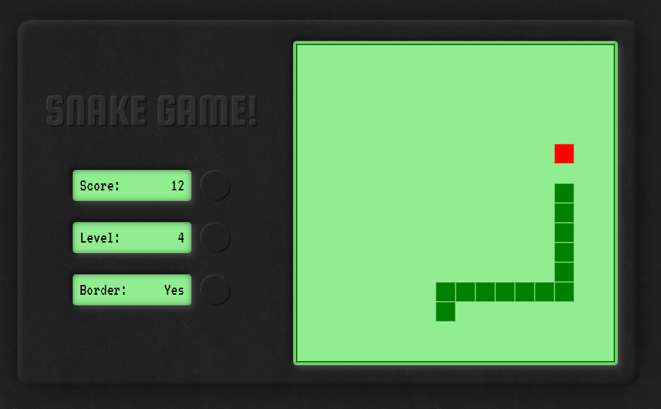

# Snake Game
Ampliação da aula de javascript da Gabriela Pinheiro, na Digital Innovation One "Recriando o jogo da cobrinha com JavaScript".

A partir da aula básica, adicionei um estilo visual ao jogo e adicionei as funções: Pontuação (Score), Velocidade (Level) e Borda (Border). O jogo agora conta pontuação a cada "maçã comida" pela cobra. Também é possível aumentar a velocidade do jogo e adicionar ou remover uma borda, onde a cobra não possa atravessar para o outro lado, deixando o jogo mais difícil.

É possível ver nos commits o desenvolviento do jogo desde o ínicio.

Disponível online em http://personalnerd.net.br/snakegame

